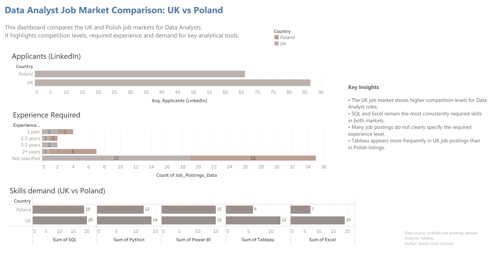

# Data Analyst Job Market Comparison: UK vs Poland

**Tableau | Data Analysis | Labour Market Analytics | Business Intelligence**

---

## Dashboard Preview



---

## Overview

This project analyses the job market for **Data Analysts in the United Kingdom and Poland** using a dataset of LinkedIn job postings.

The objective of the analysis was to compare:

- competition levels (number of applicants)
- experience expectations
- demand for key analytical tools

The analysis was conducted using **Tableau** and the results are presented through a dashboard designed to support quick interpretation of labour market trends.

---

## Business Context

The analytics job market is highly competitive and requirements vary across countries.

For professionals entering the data analytics field, understanding job market trends helps identify:

- typical competition levels
- most frequently requested analytical tools
- experience expectations for entry-level roles

This project compares the **UK and Polish Data Analyst job markets** to better understand how skill demand and competition differ between the two countries.

---

## Dataset

**Source:** LinkedIn job postings dataset

The dataset contains information extracted from job advertisements, including:

- Country
- Number of applicants per job posting
- Experience level mentioned in the job description
- Analytical tools required (SQL, Python, Power BI, Tableau, Excel)

The dataset was prepared in **Microsoft Excel** and analysed using **Tableau**.

---

## Tools & Technologies

- **Tableau**
- **Microsoft Excel**

---

## Analysis Performed

The analysis focuses on three key aspects of the job market:

### 1. Competition Levels

The dashboard compares the **average number of applicants per job posting** in the UK and Poland.

The analysis shows that:

- UK roles receive **approximately 86 applicants on average**
- Polish roles receive **around 66 applicants on average**

This suggests significantly higher competition for Data Analyst positions in the UK market.

---

### 2. Experience Requirements

Job postings were analysed to identify how frequently different experience levels are requested.

The dataset shows that:

- many job postings **do not clearly specify the required experience**
- roles requiring **2+ years of experience appear more frequently in UK listings**

This may indicate stronger expectations for prior experience in the UK market.

---

### 3. Demand for Analytical Tools

The dashboard compares how often key analytical tools appear in job descriptions.

In the analysed dataset:

| Tool | Poland | UK |
|-----|------|------|
| SQL | 19 | 20 |
| Python | 12 | 14 |
| Power BI | 15 | 15 |
| Tableau | 6 | 12 |
| Excel | 7 | 19 |

Key observations:

- **SQL and Excel remain the most consistently required skills**
- **Tableau appears twice as frequently in UK job postings**
- Power BI demand appears similar across both markets

---

## Dashboard

The Tableau dashboard presents:

- average applicants per job posting
- distribution of required experience levels
- comparison of analytical tool demand

The visualisation allows quick comparison between the **UK and Polish Data Analyst job markets**.

---

## Key Business Insights

The analysis highlights several important observations:

- Data Analyst roles in the **UK attract significantly more applicants** than in Poland.
- **SQL and Excel remain the most frequently requested analytical skills**.
- **Tableau demand is notably higher in the UK job market**.
- A large proportion of job postings **do not clearly specify required experience**, which may create uncertainty for junior candidates.

---

## Repository Structure


```
data-analyst-job-market-uk-vs-poland
│
├── screenshots
│   └── data-analyst-job-market-uk-vs-poland.png
│
├── data_analyst_job_market_dataset.xlsx
├── data_analyst_job_market_dashboard.twbx
└── README.md
```

---

## Project Files

- **data_analyst_job_market_dataset.xlsx** – dataset used for analysis  
- **data_analyst_job_market_dashboard.twb** – Tableau dashboard  
- **data-analyst-job-market-uk-vs-poland.png** – dashboard preview

---

## About This Project

This project forms part of my **data analytics portfolio** and demonstrates the use of **Tableau to analyse labour market data and communicate insights through business-focused data visualisation**.

## Kaggle Dataset
This dataset is also available on Kaggle:
[(https://www.kaggle.com/datasets/dziduszka/data-analyst-job-market-uk-vs-poland)]
